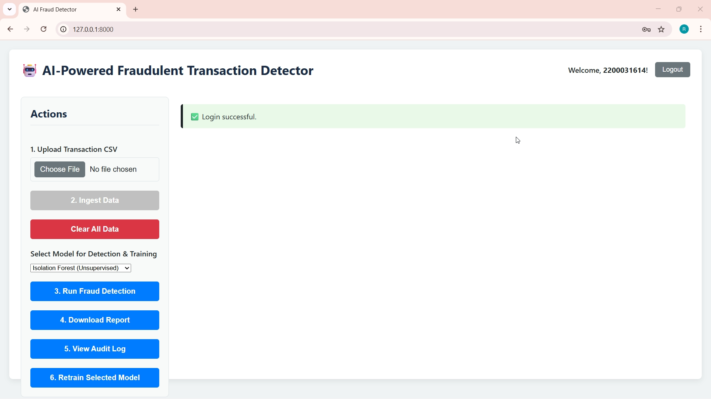

# 🕵️‍♂️ AI-Powered Fraud Detection System


A comprehensive, full-stack application designed to detect fraudulent financial transactions using a machine learning model, served via a high-performance FastAPI backend and visualized with a modern React frontend.



---

## 📋 Table of Contents

- [Key Features](#-key-features)
- [Tech Stack](#-tech-stack)
- [Project Structure](#-project-structure)
- [🚀 Getting Started](#-getting-started)
  - [Prerequisites](#prerequisites)
  - [Installation & Setup](#installation--setup)
- [How to Use](#-how-to-use)
- [API Endpoints](#-api-endpoints)
- [Troubleshooting & Notes](#-troubleshooting--notes)
- [License](#-license)
- [Author](#️-author)

---

## ✨ Key Features
-**Modular Multi-Model ML Core:** Seamlessly switch between multiple fraud detection algorithms (Isolation Forest, Random Forest, Logistic Regression, Decision Tree) via the UI for comparative analysis.
-**Secure User Authentication:** Robust signup and login system using JWT tokens with a configurable 30-minute session timeout to secure all sensitive endpoints.
-**Encrypted Data Storage:** Sensitive data, such as credit card numbers, is encrypted using the cryptography library before being stored in the SQLite database, ensuring data privacy.
-**High-Performance Batch Ingestion:** Efficiently ingest and append large transaction datasets from CSV files into the database.
-**Asynchronous Fraud Detection:** Run ML detection models as background tasks using FastAPI's built-in support, preventing UI freezes and allowing for a smooth user experience.
-**Real-time Progress Monitoring:** A dedicated API endpoint provides live progress updates on the status of the detection process, reflected dynamically on the frontend.
-**Comprehensive Reporting:** View detailed fraud reports directly in the UI and download a complete CSV file for offline analysis.
-**Complete Audit Trail:** Log every significant user action (ingestion, detection runs, model retraining, data clearing) for accountability and tracking.
-**On-Demand Model Retraining:** Trigger the ML model retraining process at any time via an API endpoint to keep the models updated with the latest data patterns.

---
## 🤖 Machine Learning Models & Workflow
This system employs a sophisticated, cyclical workflow that leverages both unsupervised and supervised learning to achieve high accuracy.
Available Models
-**Isolation Forest (Unsupervised):** Ideal for initial analysis on unlabeled data. It excels at identifying anomalies and outliers that are likely fraudulent.
-**Random Forest (Supervised):** The most powerful and accurate model in the suite. It is a robust ensemble method that provides a great balance of performance and feature insight. Training is parallelized using n_jobs=-1 for maximum speed.
-**Logistic Regression & Decision Tree (Supervised):** Excellent for establishing a performance baseline and for their high interpretability, allowing for easy-to-understand decision rules.
-**Recommended Workflow**
The application is designed for a powerful, three-stage process:
Labeling with Isolation Forest:
-**1.Ingest Data:** Upload a new transaction CSV file.
-**2.Select Model:** Choose Isolation Forest from the dropdown.
-**3.Run Detection:** This initial run will process the unlabeled data and generate the first set of labels (fraud / not-fraud).
-**4.Training Supervised Models:**
 --  **a.Select Model:** Choose a supervised model like Random Forest.
 --  **b.Train Model:** Click the "Retrain Selected Model" button. The model will now train on the rich, labeled dataset created in the previous step, learning complex fraud patterns. This creates a saved .pkl file for the model.
**High-Accuracy Detection then Select Model:** Keep Random Forest selected.
-**5.Run Detection:** Run the fraud detection again. The system will now use the highly accurate, trained supervised model to find fraudulent transactions with greater precision.

## 🛠️ Tech Stack

| Category      | Technology                                                                                                                                              |
| ------------- | ------------------------------------------------------------------------------------------------------------------------------------------------------- |
| **Backend** | **Python**, **FastAPI**, **SQLAlchemy** (ORM), **Uvicorn** (ASGI Server), **Pydantic** (Data Validation)                                                   |
| **ML/Data** | **Scikit-learn**, **Pandas**, **Joblib** (Model Persistence)                                                                                              |
| **Frontend** | **HTML5**, **CSS3**, **JavaScript (ES6+)**, **PapaParse** (CSV Parsing)                                                                                    |
| **Database** | **SQLite** |
| **Security** | **JWT (JSON Web Tokens)** for authentication, **Passlib** & **Bcrypt** for password hashing, **Cryptography** for data encryption                          |
| **Dev Tools** | **Git**, **GitHub**, **Virtualenv** |

## 📦 Project Structure

```plaintext
fraud_detector/
│
├── app/                  # FastAPI backend module
│   ├── main.py           # Main FastAPI app: API endpoints, startup events, middleware
│   ├── database.py       # SQLAlchemy models and database session management
│   ├── security.py       # JWT creation, password hashing, data encryption
│   ├── services.py       # Business logic (e.g., generating reports)
│   └── ...
│
├── frontend/             # React + TailwindCSS frontend application
│   ├── index.html        # Main HTML file
│   ├── script.js         # JavaScript logic for the UI
│   └── style.css         # Compiled TailwindCSS styles
│
├── ml/                   # Machine Learning model and utility scripts
│   ├── model.py          # Model loading, training, and prediction logic
│
├── .gitignore            # Specifies intentionally untracked files
├── requirements.txt      # Python dependencies for the project

└── README.md             # This file
```

## 🚀 Getting Started
Follow these instructions to get a copy of the project up and running on your local machine.

**1.Clone the Repository**


```
git clone [https://github.com/](https://github.com/)<your-username>/<your-repo>.git
cd fraud_detector

```
**2.Create and Activate a Virtual Environment**
**On Windows:**
```
python -m venv .venv
.venv\Scripts\activate
```
**On macOS/Linux:**
```
python -m venv .venv
source .venv/bin/activate
```
**3.Install Dependencies**
```
pip install -r requirements.txt
```
**4.Run the Application**

**Start the Backend Server:**
```
uvicorn app.main:app --reload
```
The backend will be available at http://127.0.0.1:8000.

## 📖 How to Use
**Open the Frontend:** Navigate to http://127.0.0.1:5500 in your web browser.

**Sign Up:** Create a new user account.

**Log In:** Log in with your new credentials to get an access token.

**Ingest Data:** Use the "Ingest Batch" feature to upload transaction data from a CSV file.

**Run Detection:** Start the fraud detection process and monitor its progress.

**View & Download Report:** Once detection is complete, view the fraudulent transactions in the report table or download it as a CSV.


## 🔌 API Endpoints
| Method | Endpoint                      | Description                                        |
| :----- | :---------------------------- | :------------------------------------------------- |
| `POST` | `/users/`                     | Creates a new user.                                |
| `POST` | `/token`                      | Authenticates a user and returns a JWT.            |
| `POST` | `/ingest_batch/`              | Ingests a batch of transactions from a request.    |
| `POST` | `/transactions/clear`         | Clears all transaction data from the database.     |
| `POST` | `/model/retrain`              | Starts the model retraining process.               |
| `POST` | `/detection/start`            | Initiates the fraud detection background task.     |
| `GET`  | `/detection/progress`         | Gets the real-time progress of the detection task. |
| `GET`  | `/fraud/report`               | Retrieves a paginated list of fraud cases.         |
| `GET`  | `/fraud/report/download`      | Downloads the full fraud report as a CSV file.     |
| `GET`  | `/audit_log/`                 | Retrieves the complete audit log of all actions.   |


## ⚠️ Troubleshooting & Notes
**Important: Ignoring Large Files**
The .gitignore file is configured to ignore sensitive and large files like transactions.db, raw datasets (.csv), and the Python virtual environment (.venv). Do NOT commit these files to your repository.

**CORS Issues**
The app/main.py file is pre-configured with a permissive CORS policy for local development. If you deploy this application, you should restrict the allow_origins to your frontend's specific domain.

Python
```
app.add_middleware(
    CORSMiddleware,
    allow_origins=["[http://127.0.0.1:5500](http://127.0.0.1:5500)"], # Change to your domain in production
    allow_credentials=True,
    allow_methods=["*"],
    allow_headers=["*"],
)
```

***Cleaning Git History*** (If large files were committed accidentally)
If you accidentally commit a large file, you can remove it from your repository's history using git-filter-repo.

Bash
```

pip install git-filter-repo
Then, run the command to remove a specific file or folder
git filter-repo --path transactions.db --invert-paths --force
git filter-repo --path transactions/ --invert-paths --force
git push origin main --force

```

## 📜 License
This project is distributed under the MIT License. See the LICENSE file for more information.

## ✍️ Author
R.A.R. Sriprada
Passionate about AI, Machine Learning, and building robust backend systems.
**GitHub: @RARSriprada**
**LinkedIn:Rupakula Annapurna Raja Sriprada**


